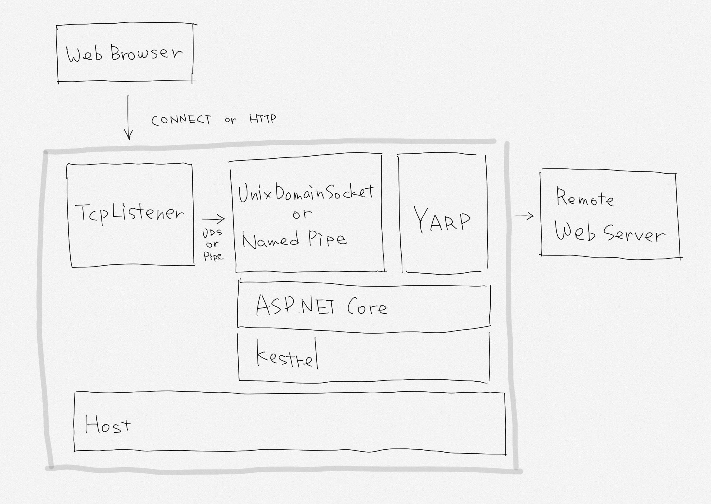

# Yafp

ASP.NET Core + YARP-based library for implementing customizable forward proxy server.

> [!IMPORTANT]
> This project is a PoC and is not recommended for production use, but it works well for hobby use with customization.
> It can be used as a replacement for Titanium Web Proxy, etc.

## Architecture


## Demo (Blazor + Yafp)
<video src="docs/video-01.mp4"></video>

## Quick start

Install Yafp package from NuGet.

```bash
dotnet add package Yafp
```

Next, create an empty Web Application (ASP.NET Core Empty) project and modify Program.cs as follows:

```csharp
using Yafp;

var builder = WebApplication.CreateBuilder(args);

// Add: Register Yafp services
builder.WebHost.UseYafpForwardProxy();

var app = builder.Build();

// Add: Use forward proxy middleware
app.MapForwardProxy();

app.MapGet("/", () => "Hello World!");
app.Run();
```

Next, add the proxy port and certificate settings in appsettings.json. Here we specify `18080` as the proxy port and use the sample certificate (`ca.key`, `ca.pem`).

```json
{
  "Yafp": {
    "ListenPort": 18080,
    "RootCertificate": {
      "Path": "ca.pem",
      "KeyPath": "ca.key"
    }
  },
  ...
}
```

> [!WARNING]
> To access HTTPS, the CA certificate must be trusted. It is recommended that you create and trust your own certificates in the steps described below.

Last, Set the browser's HTTP proxy port to `localhost:18080`.

Now, launch the application, and if you can access `http://www.example.com/` from your browser, you are done. You should see YARP logs in your console.

### Create CA private key/certificate

Instead of using the temporary private key/certificate included in the repository, you can create your own.

```bash
openssl genrsa -out ca.key 2048
openssl req -x509 -sha256 -new -nodes -key ca.key -days 3650 -out ca.pem
```

To trust a certificate in Windows, you can create a `.der` file with the following command:

```bash
openssl x509 -outform der -in ca.pem -out ca.der
```